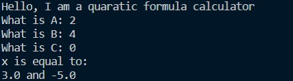
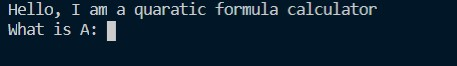
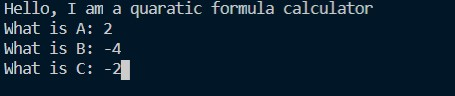
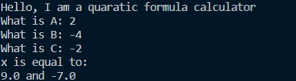

# This program uses Python 3.8.6

This is a quadratic equation solver that gives two answers x1 and x2. It does not accept complex numbersas input, _however_ it can and will return complex numbers as the answers. This is the first Python program 9other than Hello World) that I wrote.  So far, it's been fun.

## Execution

To run the program `quadratic_formula.py`

You may open with [Python 3.8.6](https://www.python.org/) with your development envornment of choice. I shall use Visual Studio Code (VS Code) as that is what I'm familar with and prefer using.

1. Make sure that [Python 3.8.6](https://www.python.org/) is installed and set up with your development envornment. VS Code  will suggest a python extension if Python is already installed. 

2. Set up a virtual envornment via the teminal (VS Code). This can be done via the following command "py -m venv venv" wich will make a copy of the current version of Python being used for the hello world program.

3. Run the program. this can be done by pressing  F5 or Ctrl+F5 to run without debugging.

4. The program will open with this result 
    
   and will ask for three inputs.
     
   Each representing the three parts of a quadratic equation. Enter in the corresponding numbers.
   
5. You will get this result 
    

#### _Yay_! This is still a simple program, but still. 